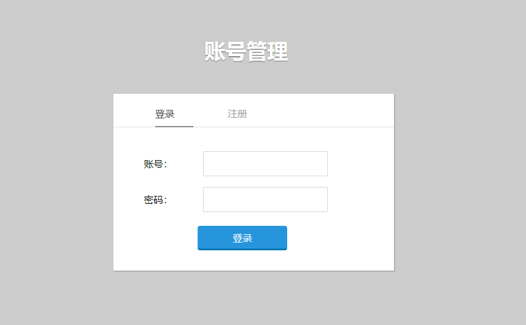
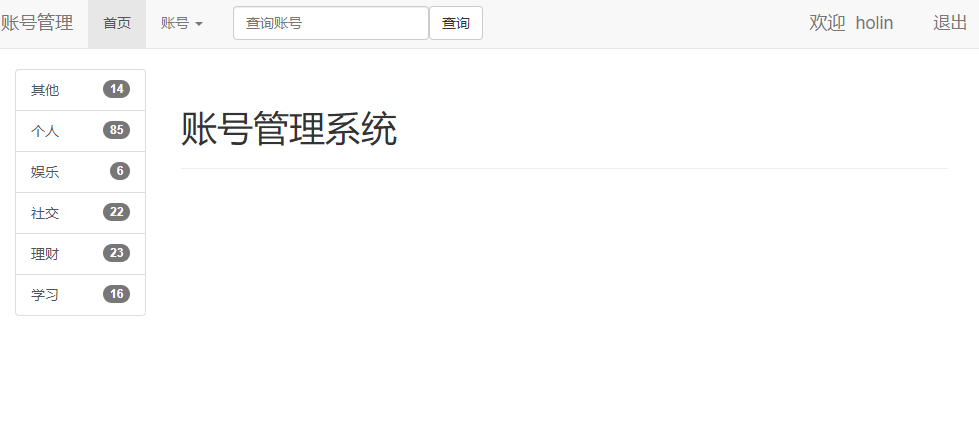

# 密码管理

php 8.3     mysql 5.7

### 部署方式

1、创建数据库，使用根目录的db.sql创建数据表

2、把代码上传到服务器，

3、把config文件夹的sample.php创建副本改成config.php

4、填写数据库的配置信息，数据库服务器IP、数据库名、数据库用户名、密码、端口号

5、可以根据需要修改AES加密配置

​	AES_IV64：是Base64编码的初始化向量，对于AES-256-CBC模式，IV长度必须为16字节(128位)，Base64编码后约为24个字符

​	AES_KEY：用于AES加密和解密的密钥，对于AES-256，密钥必须为32个字符

### 登录
 

### 账号界面
 
